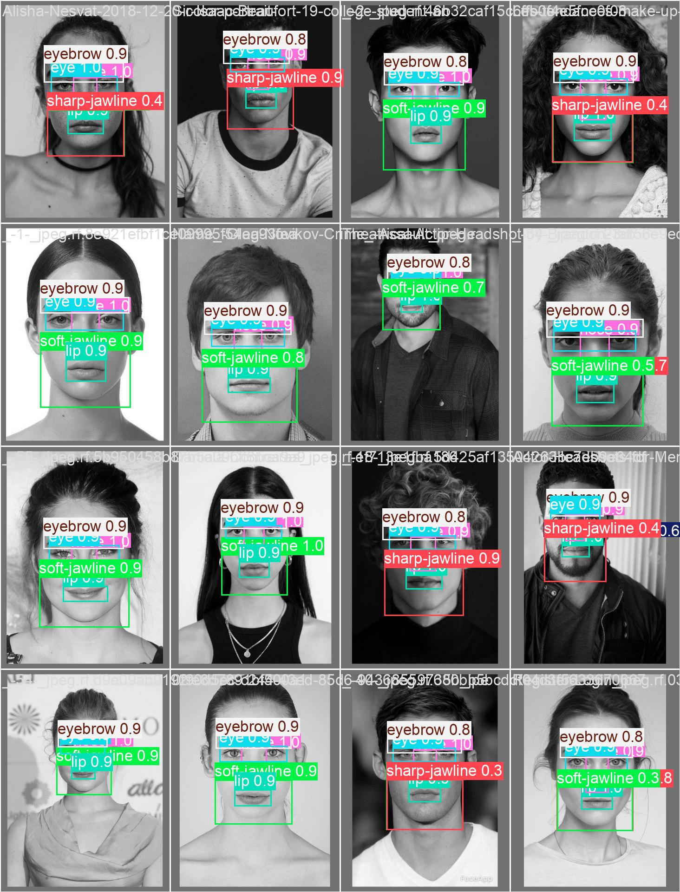
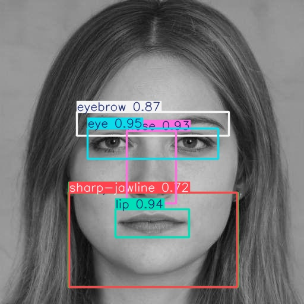

---
jupyter:
  accelerator: GPU
  colab:
    gpuType: T4
    include_colab_link: true
  kernelspec:
    display_name: Python 3
    name: python3
  language_info:
    name: python
  nbformat: 4
  nbformat_minor: 0
---
**How to Train YOLO11 Object Detection Model on a Custom Dataset**
:::

outputId="0f37daf0-fff1-45e7-a9e6-9464c5596f22"}
``` python
!nvidia-smi
```

**Step 01 \# Install the Ultralytics Package**
:::

``` python
!pip install ultralytics
```

**Step 02 \# Import All the Requried Libraries**
:::

``` python
import ultralytics
ultralytics.checks()
```

``` python
from ultralytics import YOLO
from IPython.display import Image
```


**Step \# 03 Download Dataset from Roboflow**
:::

``` python
!pip install roboflow

from roboflow import Roboflow
rf = Roboflow(api_key="____________________")
project = rf.workspace("test-tnuvx").project("extracting-facial-features-ykifq-bjqdx")
version = project.version(3)
dataset = version.download("yolov11")
```

``` python
dataset.location
```

**Step \# 04 Train YOLO11 Model on a Custom Dataset**
:::

``` python
!yolo task=detect mode=train data={dataset.location}/data.yaml model="yolo11n.pt" epochs=40 imgsz=640
```

**Step \# 05 Examine Training Results**
:::

``` python
Image("/content/runs/detect/train4/P_curve.png", width=600)
```

::: {.output .execute_result execution_count="32"}


``` python
Image("/content/runs/detect/train4/R_curve.png", width=600)
```

::: {.output .execute_result execution_count="33"}


::: {.cell .code colab="{\"base_uri\":\"https://localhost:8080/\",\"height\":467}" id="vHVXACym1VZk" outputId="841a8187-0b0f-432b-85f9-ce236f49403c"}
``` python
Image("/content/runs/detect/train4/confusion_matrix.png", width=600)
```

::: {.output .execute_result execution_count="34"}
{width="600"}
:::
:::

::: {.cell .code colab="{\"base_uri\":\"https://localhost:8080/\",\"height\":467}" id="GMMRL5LT1b0L" outputId="5acb0b5d-46ac-4b0f-d522-7209e07e8c3a"}
``` python
Image("/content/runs/detect/train4/confusion_matrix_normalized.png", width=600)
```

::: {.output .execute_result execution_count="35"}
{width="600"}
:::
:::

::: {.cell .code colab="{\"base_uri\":\"https://localhost:8080/\",\"height\":617}" id="bffrCmrH1izb" outputId="08b7fd42-1734-4bd3-e2c1-1d5e5c23e85f"}
``` python
Image("/content/runs/detect/train4/labels.jpg", width=600)
```

::: {.output .execute_result execution_count="36"}
{width="600"}
:::
:::

::: {.cell .code colab="{\"base_uri\":\"https://localhost:8080/\",\"height\":317}" id="PeSiFrwP1tbF" outputId="be3db45d-976d-4fc4-efb9-41a97523ac90"}
``` python
Image("/content/runs/detect/train4/results.png", width=600)
```

::: {.output .execute_result execution_count="37"}
{width="600"}
:::
:::

::: {.cell .code colab="{\"base_uri\":\"https://localhost:8080/\",\"height\":617}" id="RacyVWK3103E" outputId="b46510b0-a37f-4547-ec7d-48cd39e2953f"}
``` python
Image("/content/runs/detect/train4/train_batch0.jpg", width=600)
```

::: {.output .execute_result execution_count="38"}
{width="600"}
:::
:::

::: {.cell .code colab="{\"base_uri\":\"https://localhost:8080/\",\"height\":617}" id="idaZDidT10_L" outputId="bff75243-089a-41b7-d04f-ac8d147fca14"}
``` python
Image("/content/runs/detect/train4/val_batch0_pred.jpg", width=600)
```

::: {.output .execute_result execution_count="39"}
{width="600"}
:::
:::

::: {.cell .code colab="{\"base_uri\":\"https://localhost:8080/\",\"height\":757}" id="VPEj-hRA11Pn" outputId="de5aae30-862b-4d22-ff03-ab3bddc07f1f"}
``` python
Image("/content/runs/detect/train4/val_batch1_pred.jpg", width=600)
```

::: {.output .execute_result execution_count="40"}


``` python
Image("/content/runs/detect/train4/val_batch2_pred.jpg", width=600)
```

::: {.output .execute_result execution_count="41"}


::: {.cell .markdown id="T8eXR6l03d-Q"}
**Step \# 06 Download the Model Weights from the Google Drive**
:::

::: {.cell .markdown id="alfU2d0z41X6"}
**Step \# 07 Validate Fine-Tuned Model**
:::

``` python
!yolo task=detect mode=val model="/content/runs/detect/train4/weights/best.pt" data={dataset.location}/data.yaml
```

::: {.output .stream .stdout}
    Ultralytics 8.3.73 🚀 Python-3.11.11 torch-2.5.1+cu124 CUDA:0 (Tesla T4, 15095MiB)
    YOLO11n summary (fused): 238 layers, 2,583,907 parameters, 0 gradients, 6.3 GFLOPs
    val: Scanning /content/Extracting-Facial-Features-3/valid/labels.cache... 153 images, 0 backgrounds, 0 corrupt: 100% 153/153 [00:00<?, ?it/s]
                     Class     Images  Instances      Box(P          R      mAP50  mAP50-95): 100% 10/10 [00:03<00:00,  2.95it/s]
                       all        153        765        0.9      0.789      0.842      0.739
                       eye        153        153          1       0.98      0.995       0.84
                   eyebrow        153        153          1      0.981      0.995      0.822
                       lip        153        153          1      0.993      0.995      0.896
            mustache-beard          1          1      0.701          1      0.995      0.895
                      nose        153        153          1          1      0.995      0.892
             sharp-jawline         27         27      0.605      0.624      0.638      0.574
        slight-double-chin          5          5          1          0      0.196      0.178
              soft-jawline        120        120      0.898      0.734      0.928      0.815
    Speed: 2.1ms preprocess, 7.1ms inference, 0.0ms loss, 2.3ms postprocess per image
    Results saved to runs/detect/val
    💡 Learn more at https://docs.ultralytics.com/modes/val
:::
:::

::: {.cell .markdown id="OOdt0GSA5ntm"}
**Step \# 08 Inference with Custom Model on Images**
:::

::: {.cell .code colab="{\"base_uri\":\"https://localhost:8080/\"}" collapsed="true" id="E1dU-fiz3sUr" outputId="8cb86c21-c666-450f-e82f-5f96d0ff8298"}
``` python
!yolo task=detect mode=predict model="/content/runs/detect/train4/weights/best.pt" conf=0.25 source={dataset.location}/test/images save=True
```

``` python
import glob
import os
from IPython.display import Image as IPyImage, display

latest_folder = max(glob.glob('/content/runs/detect/predict/'), key=os.path.getmtime)
for img in glob.glob(f'{latest_folder}/*.jpg')[1:4]:
    display(IPyImage(filename=img, width=600))
    print("\n")
```

::: {.output .display_data}
{width="600"}
:::

::: {.output .stream .stdout}
:::

::: {.output .display_data}
{width="600"}
:::

::: {.output .stream .stdout}
:::

::: {.output .display_data}
{width="600"}
:::

::: {.output .stream .stdout}
:::
:::

::: {.cell .code id="uyJMJ5-m7rAt"}
``` python
# delete folder and its content
#import shutil
#shutil.rmtree('/content/runs/detect/predict3')
```
:::

``` python
!yolo task=detect mode=predict model="/content/runs/detect/train4/weights/best.pt" conf=0.25 source='' save=True
```


**Step \# 08 Inference with Custom Model on Videos**
:::

``` python
!yolo task=detect mode=predict model="/content/runs/detect/train4/weights/best.pt" conf=0.25 source="/content/amazon.mp4" save=True
```

``` python
!rm '/content/result_compressed.mp4'
```

``` python
from IPython.display import HTML
from base64 import b64encode
import os

# Input video path
save_path = '/content/runs/detect/predict4/amazon.avi'

# Compressed video path
compressed_path = "/content/result_compressed.mp4"

os.system(f"ffmpeg -i {save_path} -vcodec libx264 {compressed_path}")

# Show video
mp4 = open(compressed_path,'rb').read()
data_url = "data:video/mp4;base64," + b64encode(mp4).decode()
HTML("""
<video width=400 controls>
      <source src="%s" type="video/mp4">
</video>
""" % data_url)
```
